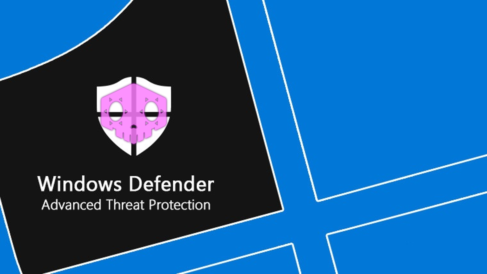
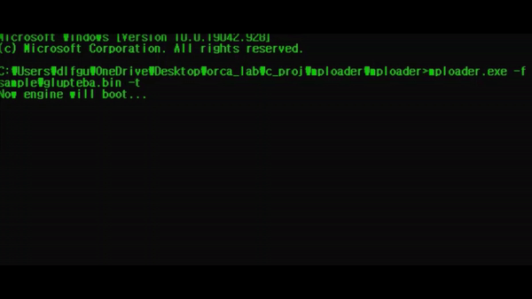

<!--
*** Thanks for checking out the Best-README-Template. If you have a suggestion
*** that would make this better, please fork the repo and create a pull request
*** or simply open an issue with the tag "enhancement".
*** Thanks again! Now go create something AMAZING! :D
-->


<!-- PROJECT SHIELDS -->
<!--
*** I'm using markdown "reference style" links for readability.
*** Reference links are enclosed in brackets [ ] instead of parentheses ( ).
*** See the bottom of this document for the declaration of the reference variables
*** for contributors-url, forks-url, etc. This is an optional, concise syntax you may use.
*** https://www.markdownguide.org/basic-syntax/#reference-style-links
-->

<!-- PROJECT LOGO -->
<br />

<!-- ABOUT THE PROJECT -->

## About The Project




This project based on [taviso](https://github.com/taviso)/**[loadlibrary](https://github.com/taviso/loadlibrary)**

This demo is a simple PoC of Customizable and Portable Windows Defender

You can make the your own customized functions by hooking functions of Windows Defender.


<!-- GETTING STARTED -->
## Getting Started



```sh
mploader.exe -f "target_file"
```


### Prerequisites

* ISO C++17 표준(/std:c++17)
  
* MPEngine and it's AV Container
  
  ```sh
  https://drive.google.com/drive/folders/1ESzYr4aD7kyrdwrwzVYhdR3A_DQA0H_1?usp=sharing
  ```

### Installation

1. Clone the repo
   ```sh
   git clone https://github.com/orca-eaa5a/mploader.git
   ```
   
2. Locate the MPEngine and AV Container at "engine" directory

   

<!-- USAGE EXAMPLES -->

## Usage

* Options

   ```sh
   -h  --help                      : print Help page
   -f  --file $filename            : target file to scan
   -r  --relate                    : print related threats
   -u  --unpack                    : enable unpacking method
   -p  --percious                  : makes engine more precisely
   -t  --trace                     : trace the treat detected point
   -l  --log [--reg] [--ignore]    : enable logging api call with stack trace
   -lt --loop-threshold            : modify maximum loop threshold
   ```

<!-- LICENSE -->

## License

Distributed under the MIT License.


